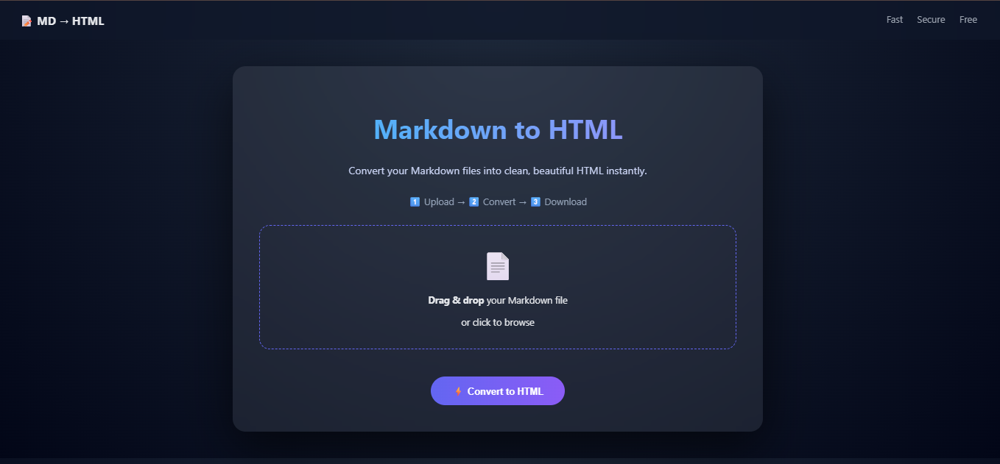
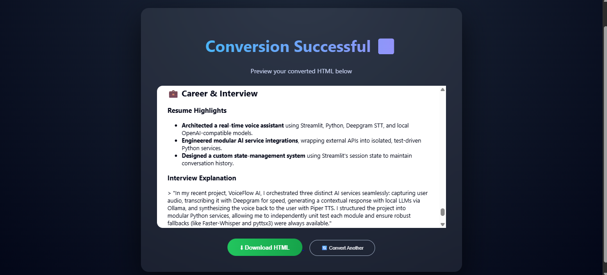

# 📝 AI Markdown Studio

<div align="center">


### 🚀 Modern Markdown to HTML Converter

Convert Markdown files into clean, structured HTML with drag-and-drop uploads, instant conversion, preview functionality, and downloadable HTML exports.

</div>

---

## 📌 Overview

MarkdownStudio is a Flask-based web application that transforms Markdown documents into production-ready HTML pages.

The platform provides an intuitive drag-and-drop interface where users can upload Markdown files, convert them into HTML, preview the generated output, and download the converted document instantly.

---

## ✨ Features

### 📂 File Upload

* Upload Markdown (`.md`) files
* Drag-and-drop support
* File type validation

### ⚡ Conversion Engine

* Markdown → HTML conversion
* Supports:

  * Headings
  * Bold & Italics
  * Lists
  * Links
  * Code Blocks
  * Tables

### 👀 HTML Preview

* View converted HTML directly in the browser
* Clean and readable rendering

### 📥 Download Support

* Download generated HTML files
* Automatic file generation

### 🎨 Modern UI

* Glassmorphism-inspired design
* Responsive layout
* Interactive drag-and-drop area
* Loading animation

---

## 🏗️ System Architecture

```text
User
 │
 ▼
Upload Markdown File (.md)
 │
 ▼
Flask Backend
 │
 ▼
Markdown Processing Engine
 │
 ▼
HTML Generation
 │
 ├── Preview in Browser
 │
 └── Download HTML File
```

---

## 📁 Project Structure

```text
MarkdownStudio/
│
├── app.py
│
├── static/
│   ├── style.css
│   └── script.js
│
├── templates/
│   ├── index.html
│   └── result.html
│
├── uploads/
├── outputs/
│
├── requirements.txt
├── README.md
└── .gitignore
```

---

## 🛠️ Tech Stack

| Category          | Technology              |
| ----------------- | ----------------------- |
| Backend           | Python, Flask           |
| Frontend          | HTML5, CSS3, JavaScript |
| Conversion Engine | Python-Markdown         |
| File Handling     | Werkzeug                |
| Styling           | Custom CSS              |

---

## ⚙️ Installation

### Clone Repository

```bash
git clone https://github.com/your-username/MarkdownStudio.git
cd MarkdownStudio
```

### Install Dependencies

```bash
pip install -r requirements.txt
```

### Run Application

```bash
python app.py
```

### Open Browser

```text
http://127.0.0.1:5000
```

---

## 🔄 Workflow

```text
1. Upload Markdown File
        ↓
2. Convert Markdown
        ↓
3. Generate HTML
        ↓
4. Preview Result
        ↓
5. Download HTML File
```

---

## 📸 Screenshots

### Home Page



### Conversion Result



---

## 📊 Key Highlights

* Modular Flask Architecture
* Secure File Upload Handling
* Responsive User Interface
* Drag-and-Drop Upload Support
* Real-Time Conversion Workflow
* Downloadable HTML Exports

---

## 🔮 Future Enhancements

* Live Markdown Preview
* Dark / Light Theme
* PDF Export
* DOCX Export
* Syntax Highlighting
* Mermaid Diagram Support
* AI-Assisted Content Formatting
* Docker Deployment

---

## 👨‍💻 Author

**Karthik**

---

## ⭐ Support

If you found this project useful, consider giving it a star on GitHub.

⭐ Star the repository
🍴 Fork the project
🚀 Contribute improvements

---
